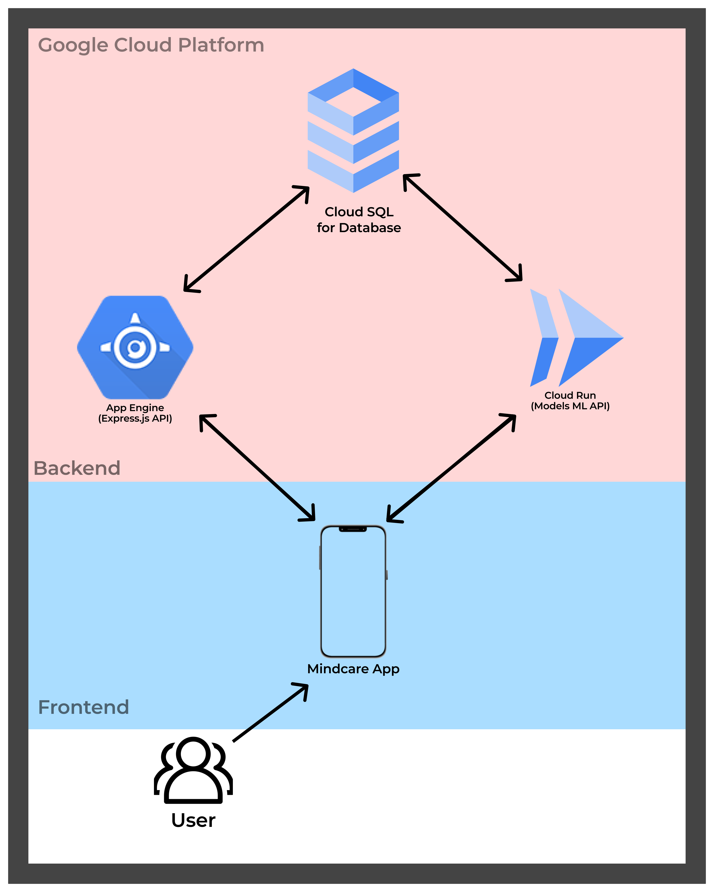

# Cloud Architecture

We as the Cloud Computing as the Diagram Above. we use App Engine for Express API, Cloud Run for Model API and Cloud SQL for the Database. why we use App Engine and Cloud Run because it's really fleksible for deploying our API and for the Database we use CLoud SQL because to reduce excessive usage of cost.
